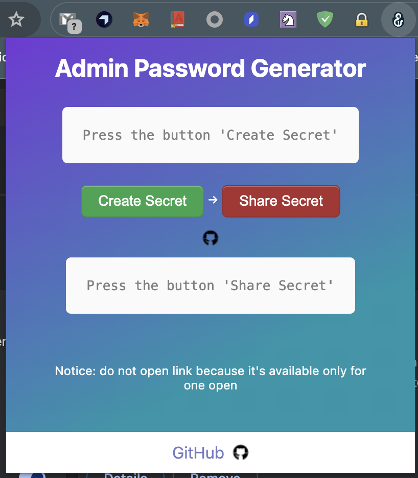
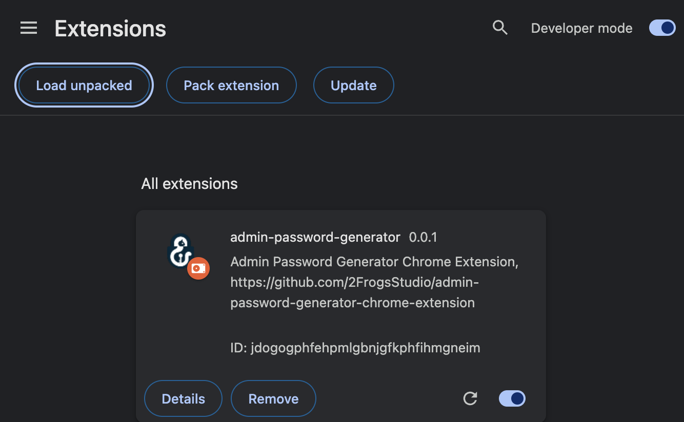

# Admin Password Generator  🚀  

Admin Password Generator is Chrome Extension for Administrators and DevOps Engeneers. It allows you fast and simple generate passwords and share it with your users


## Table of Contents ✨  

- [Description](#description)
- [Installation](#installation)
- [Usage](#usage)
- [Contributing](#contributing)
- [License](#license)

# Description

Admin Password Generator — Chrome Extension Starter provides a foundation for generate and share passwords. 



# Installation

To install and run Next.js Chrome Extension Starter locally, follow these steps:

1. Clone this repository: 

   ```bash
   git clone https://github.com/2FrogsStudio/admin-password-generator-chrome-extension.git
   ```
2. Navigate to project directory: 

   ```
   cd admin-password-generator-chrome-extension
   ```
4. Install the dependencies using npm: 
   ```
   npm install
   ```

# For developers
## Usage Locally  🔥
To run the Chrome Extension locally, follow these steps:

Run the project:
```
npm run dev
```
`This will run project on your localhost`

 http://localhost:3000/

## Build and Import To Chrome 🔥
To build and import Chrome Extension to chrome browser, follow these steps:

1. Build the project:
```
npm run build
```
`This will run prep and export to create new folder 'out/', and rename '_next' forlder to 'next' (without underscore)`

2. Open Google Chrome and go to chrome://extensions.

3. Enable the "Developer mode" toggle switch.

4. Click on "Load unpacked" and select the out folder generated by the build process.

5. The Admin Password Generator should now be loaded as an unpacked extension in Google Chrome.



# Contributing
Contributions to the Admin Password Generator Chrome Extension are welcome! If you find any issues or have suggestions for improvements, please feel free to open an issue or submit a pull request.

# License
This project is licensed under the MIT License.

Feel free to customize and modify it based on your specific requirements. 
Make sure to include any additional information, such as troubleshooting tips or specific 
Chrome extension functionality, to provide a comprehensive guide for users.

```
MIT License

Copyright (c) 2023 Nikita Rukavkov (rukavkov)

Permission is hereby granted, free of charge, to any person obtaining a copy
of this software and associated documentation files (the "Software"), to deal
in the Software without restriction, including without limitation the rights
to use, copy, modify, merge, publish, distribute, sublicense, and/or sell
copies of the Software, and to permit persons to whom the Software is
furnished to do so, subject to the following conditions:

The above copyright notice and this permission notice shall be included in all
copies or substantial portions of the Software.

THE SOFTWARE IS PROVIDED "AS IS", WITHOUT WARRANTY OF ANY KIND, EXPRESS OR
IMPLIED, INCLUDING BUT NOT LIMITED TO THE WARRANTIES OF MERCHANTABILITY,
FITNESS FOR A PARTICULAR PURPOSE AND NONINFRINGEMENT. IN NO EVENT SHALL THE
AUTHORS OR COPYRIGHT HOLDERS BE LIABLE FOR ANY CLAIM, DAMAGES OR OTHER
LIABILITY, WHETHER IN AN ACTION OF CONTRACT, TORT OR OTHERWISE, ARISING FROM,
OUT OF OR IN CONNECTION WITH THE SOFTWARE OR THE USE OR OTHER DEALINGS IN THE
SOFTWARE.

```
